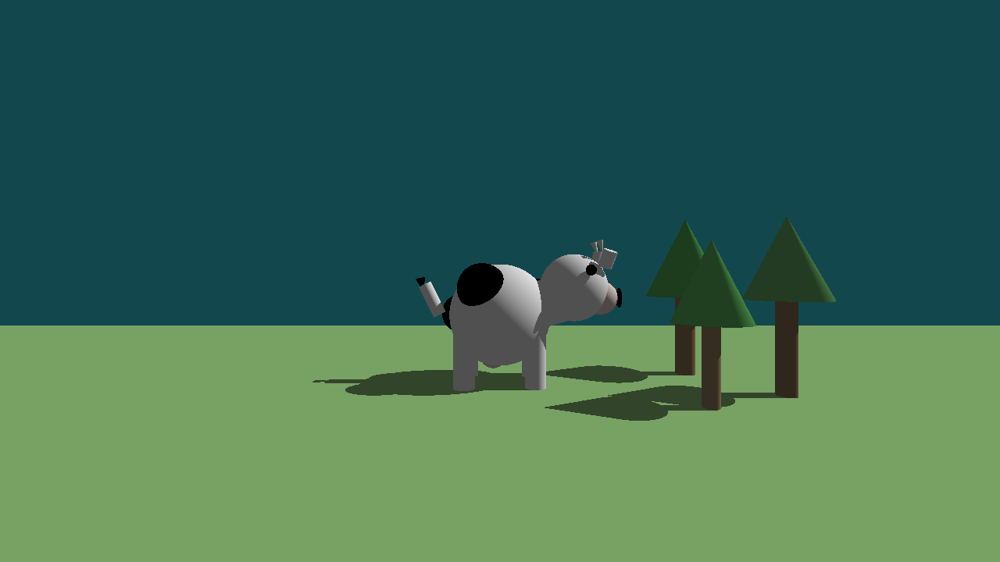
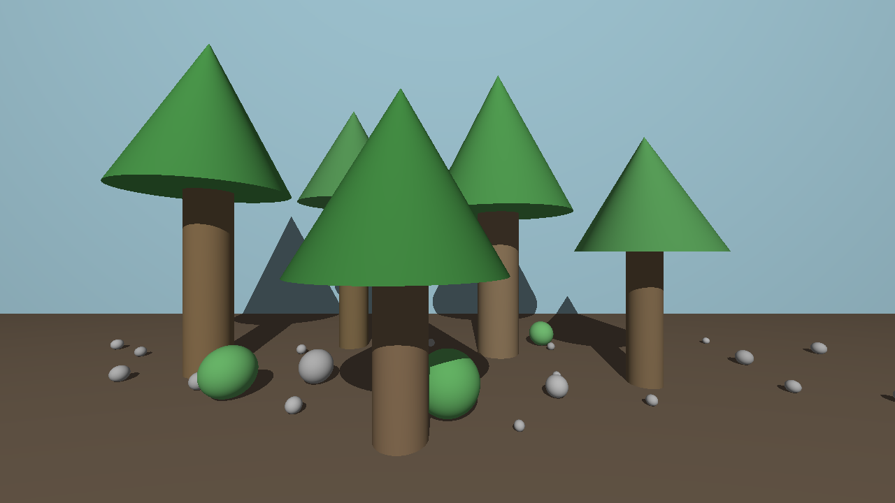
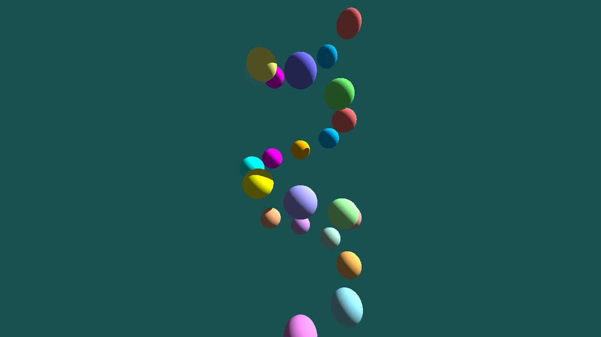
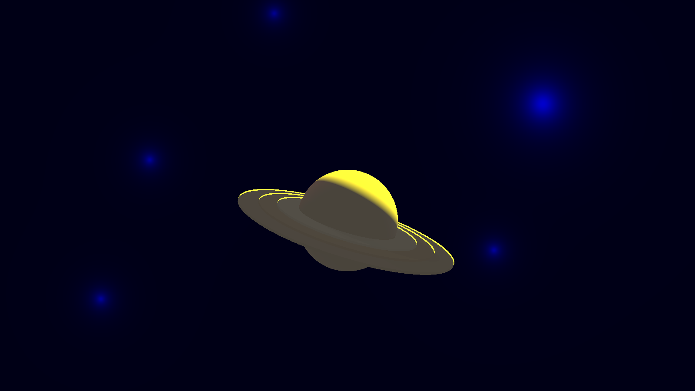

# RayTracer

## 📝 Description

RayTracer est un moteur de rendu 3D basé sur la technique du lancer de rayons. Cette technique simule le comportement de la lumière en traçant des rayons depuis la caméra à travers chaque pixel de l'écran virtuel jusque dans la scène 3D, permettant ainsi de créer des images réalistes avec des effets d'ombrage, de réflexion et de réfraction.

## 🌟 Fonctionnalités

- **Rendu de primitives 3D** : Sphères, Cylindres, Cônes, Plans
- **Système d'éclairage** : Sources de lumière directionnelles et ponctuelles
- **Chargement dynamique** : Plugins pour ajouter facilement de nouvelles primitives et sources de lumière
- **Configuration flexible** : Descriptions de scènes personnalisables via des fichiers de configuration
- **Multi-threading** : Accélération du rendu grâce au calcul parallèle
- **Import de modèles 3D** : Support des fichiers .obj pour intégrer des modèles 3D complexes
- **Générateur de configuration web** : Interface web pour créer et éditer facilement des fichiers de configuration

## 🖼️ Exemples de rendu

<div style="display: flex; justify-content: space-between; flex-wrap: wrap;">
  <div style="text-align: center; flex: 1; min-width: 200px; margin: 10px;">
    <h3>Scène "Cow"</h3>
    
  </div>
  <div style="text-align: center; flex: 1; min-width: 200px; margin: 10px;">
    <h3>Scène "Forêt"</h3>
    
  </div>
  <div style="text-align: center; flex: 1; min-width: 200px; margin: 10px;">
    <h3>Scène "Spirale"</h3>
    
  </div>
  <div style="text-align: center; flex: 1; min-width: 200px; margin: 10px;">
    <h3>Scène "Spirale"</h3>
    
  </div>
</div>

## 🛠️ Installation

```bash
# Cloner le dépôt
git clone [url-du-depot]
cd RayTracer

# Construire le projet
chmod +x build.sh
./build.sh
```

## 🚀 Utilisation

```bash
# Exécuter le ray tracer avec un fichier de configuration
./raytracer Config/basic.cfg

# Autres exemples de configuration
./raytracer Config/cow.cfg
./raytracer Config/foret.cfg
./raytracer Config/spirale.cfg
```

## 📋 Format des fichiers de configuration

Les fichiers de configuration (.cfg) permettent de décrire la scène à rendre, incluant:

```
camera = {
    fieldOfView = 90.0;
    position = { x = 2.0; y = 5.0; z = 10.0; };
    rotation = { x = 0; y = 0; z = -1; };
    resolution = { width = 1280; height = 720; };
};

primitives = {
    spheres = (
        {
          x = 0.0; y = 0.0; z = 0.0; r = 1.0;
          color = { r = 255; g = 0; b = 0; };
        }
    );
    # Autres primitives...
};

lights = {
    point = (
        {
            position = { x = 0.0; y = 30.0; z = 40.0; };
            intensity = 0.7;
            color = { r = 255; g = 255; b = 255; };
        }
    );
};
```

## 🌐 Générateur de Configuration Web

Pour faciliter la création et l'édition des fichiers de configuration, nous avons développé une interface web intuitive accessible dans le dossier `docs/`:

```bash
# Ouvrir le générateur de configuration dans votre navigateur
https://yanisprevost.github.io/RayTracer/
# Puis copié collé votre configuration dans un fichier .cfg
```

Cette interface permet de:
- Configurer visuellement tous les paramètres de la scène
- Prévisualiser la disposition des éléments
- Générer automatiquement le fichier de configuration (.cfg)

## 🧩 Architecture du projet

Le projet est organisé selon une architecture modulaire:

- **Core**: Moteur principal du ray tracer
- **Primitives**: Formes géométriques rendues (Sphère, Plan, etc.)
- **Lumières**: Sources d'éclairage (Directionnelle, Ponctuelle)
- **Parsing**: Analyse des fichiers de configuration
- **Visualisation**: Sortie des images au format PPM

## 🚀 Performances et Optimisations

### Multi-threading
Le RayTracer utilise le multi-threading pour accélérer considérablement les calculs de rendu:
- Parallélisation du calcul des pixels pour un rendu plus rapide
- Répartition optimale de la charge sur tous les cœurs du processeur
- Possibilité d'ajuster le nombre de threads pour s'adapter à différentes configurations matérielles

### Modèles 3D complexes
Le moteur prend en charge l'import de fichiers 3D au format .obj:
- Rendu de modèles 3D complexes créés dans des logiciels tiers comme Blender
- Support des normales et textures des objets
- Optimisation de la mémoire pour les modèles volumineux

```bash
# Exemple d'utilisation avec un fichier 3D
./raytracer Config/simpleObjFile.cfg
```

## 🔧 Options avancées

Le RayTracer offre plusieurs options avancées:
- Réglage de la profondeur de réflexion et de réfraction
- Contrôle de l'antialiasing pour améliorer la qualité de l'image
- Configuration des matériaux (brillance, transparence, réfraction)
- Possibilité d'ajouter de nouvelles primitives ou sources de lumière via le système de plugins

## 👥 Contributeurs
- Yanis Prevost, Raphaël Grissonnanche, Anthony Colombani-Gailleur
